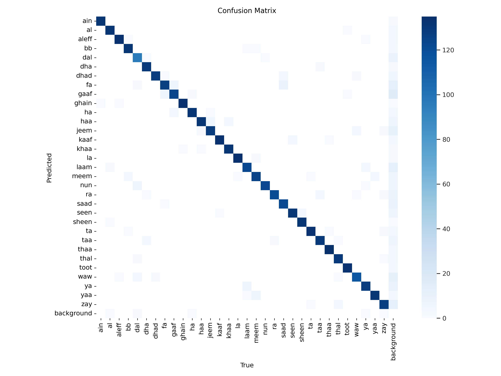

# Signify - Arabic Sign Language Translator

Signify is a real-time bidirectional Arabic Sign Language (ArSL) translation system. It utilizes YOLOv8l for gesture recognition to translate sign language into text, and employs 3D avatars to convert Arabic text into sign animations.

## Features

- **Real-time Recognition**: Uses YOLOv8l to detect and classify ArSL gestures from a webcam feed.
- **Bidirectional Translation**:
    - **Sign to Text**: Converts recognized gestures into Arabic text.
    - **Text to Sign**: (Mentioned in description) Converts Arabic text into sign animations using 3D avatars.
- **Auto-Correction**: Implements Levenshtein distance to correct recognized words against a predefined dictionary.
- **Arabic Text Support**: Handles Arabic text rendering and reshaping for correct display on frames.

## Model Performance

The model was trained using YOLOv8l and achieved the following performance metrics on the validation set:

| Metric | Value |
| :--- | :--- |
| **Precision** | 0.976 |
| **Recall** | 0.966 |
| **mAP50** | 0.989 |
| **mAP50-95** | 0.849 |

### Visualizations

<p align="center">
  
  
</p>

## Installation

1.  Clone the repository:
    ```bash
    git clone https://github.com/KarimElroby7/signify.git
    cd signify
    ```

2.  Install the required dependencies:
    ```bash
    pip install -r requirements.txt
    ```

## Usage

1.  **Important**: Before running the application, you must update the paths in `main.py` to point to your local model and font files.
    Open `main.py` and modify the following lines:

    ```python
    recognizer = ArabicSignLanguageRecognizer(
        model_path=r"path/to/your/projet.pt",  # Update this path
        font_path=r"path/to/your/arial.ttf"    # Update this path
    )
    ```

2.  Run the main script:
    ```bash
    python main.py
    ```

3.  **Controls**:
    - `ENTER`: Confirm the current word.
    - `SPACE`: Add a space.
    - `BACKSPACE`: Remove the last character.
    - `q`: Quit the application.

## Requirements

- Python 3.8+
- Webcam

## License

This project is licensed under the MIT License - see the [LICENSE](LICENSE) file for details.
